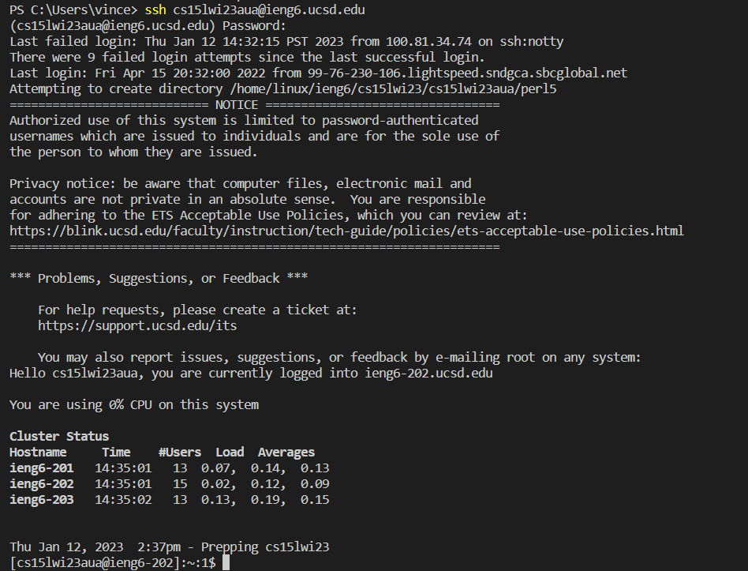

# Remote Access Connection Tutorial
This tutorial will show you how to connect your terminal to remote server.

## VSCode
* To begin this tutorial we will first need to get Visual Studio Code. I did this by going to this website [here]( https://code.visualstudio.com/) and following the installation instructions.
* Once everything was downloaded, I opened it up and it looked like this.

Keep in mind that when you open up VS Code, it may look slightly different from this screenshot.

## Remotely Connecting
Now that VS Code is installed, we will learn how to connect your terminal to a remote server in the case that you need to use a speciifc system or device.
* First, since I am using a Windows device, I needed to install [git](https://gitforwindows.org/) and made it so that your terminal uses git bash by default which you can find instructions to [here](https://stackoverflow.com/questions/42606837/how-do-i-use-bash-on-windows-from-the-visual-studio-code-integrated-terminal/50527994#50527994)
* Next, I opened up a new terminal by opening the "Terminal" tab at the top of VS Code and selected "New Terminal".  Then entered the command: 
```
$ ssh cs15lwiaua@ieng6.ucsd.edu
```
(Do not include the "$" in your terminal)
where "aua" are the letters that pertain to my course specific account which I found at [Account Lookup](https://sdacs.ucsd.edu/~icc/index.php)
Once I entered the command, this prompt showed up:


Next, I just typed "yes" into the terminal and hit enter.  


* After this, a prompt for a password appeared, but when I tried to enter my password it ended up not working because you have to reset your password even if you already know it. If you try to enter an inccorect password, it will simply give another password prompt in the next line until it eventually gives you a message about a disconnection.

[How to reset your password](https://docs.google.com/document/d/1hs7CyQeh-MdUfM9uv99i8tqfneos6Y8bDU0uhn1wqho/edit)

Once I restarted my password, I waited a few minutes and tried again, giving me this message:



This meant that I successfully connected to the terminal.

## Trying Some Commands

Now that my terminal was connected, I tried a few commands in the remote terminal, and compared the results to when the commands were run on my device.
```
Here are the commands I tried:
cd ~
cd
ls -lat
ls -a
ls <directory> where <directory> is /home/linux/ieng6/cs15lwi23/cs15lwi23aut ("aut" being the letters from the account of another group member)
cp /home/linux/ieng6/cs15lwi23/public/hello.txt ~/
cat /home/linux/ieng6/cs15lwi23/public/hello.txt
```
This first image shows the result of when I enter the commands through the remote server:


Then I used the hotkey "Ctrl-D" to exit out of the remote server. (You could also use the "exit" command in the terminal)
This next image shows the result of when I enter the commands through my own terminal:


We can that in the first image, all the commands executed without error, and when I tried to go into the directory of my group member, permission was denied.

When I tried those same commands on my own terminal, I recieved errors on almost all the commands since it tried to find paths that were not on my device.


